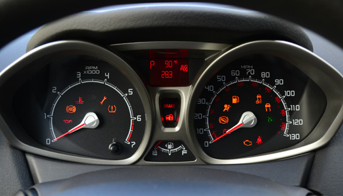
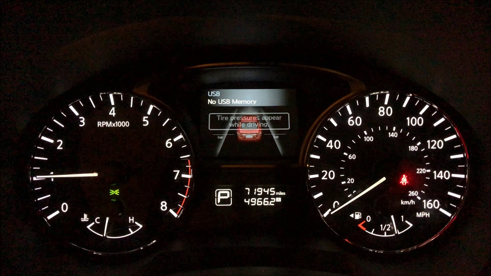
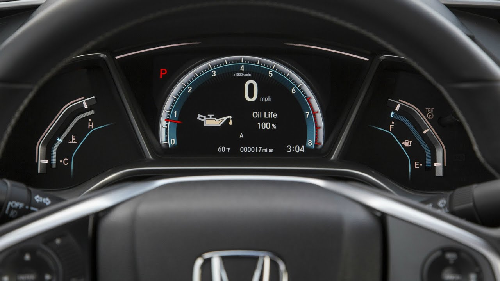
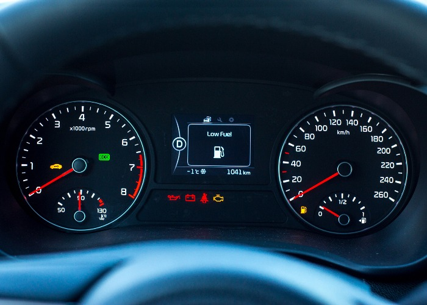
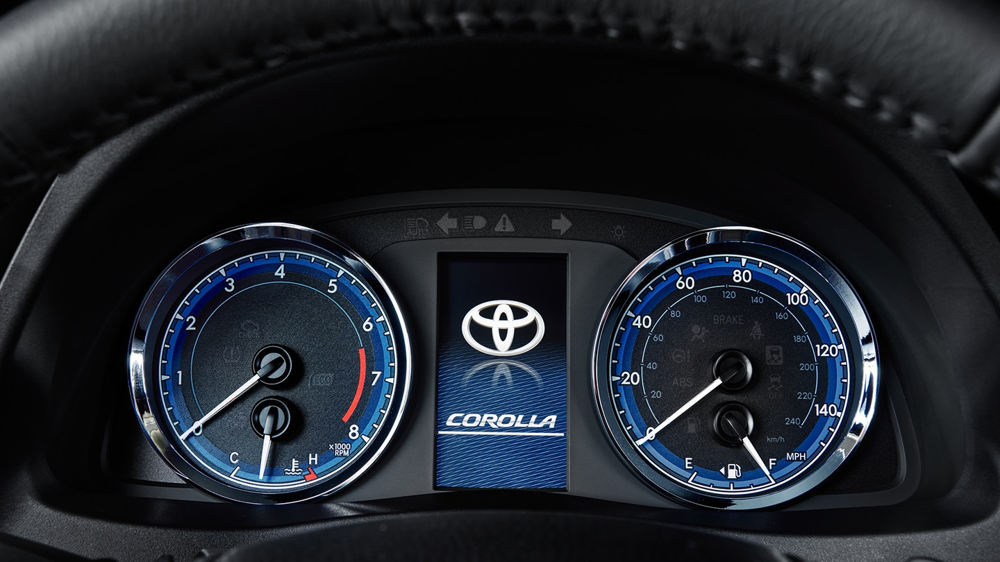
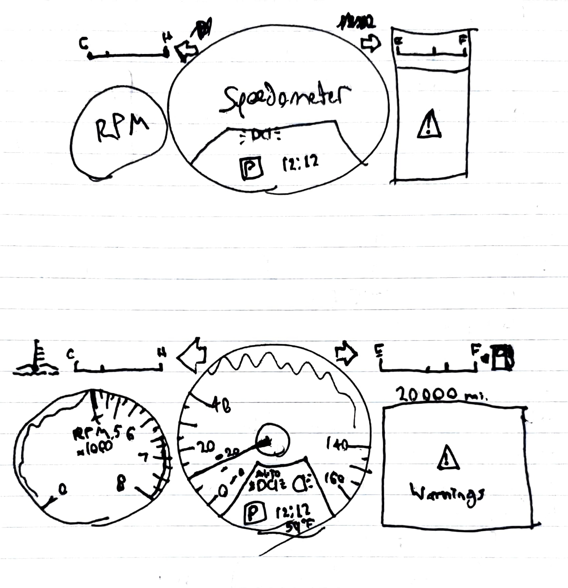

# HCIProject2

## Car Dashboard Photos

### 2012 Ford Fiesta

#### Pros

- Displays external temperature.
- Icons have high visibility even in daylight.
- Has both miles per hour and kilometers per hour.
- Shows average miles per gallon.
- Shows current gear.

#### Cons

- Needles are a little busy with their bulky interior, which can hide the warning icons in the right spot.
- Lots of visual separation between elements, like the two icons randomly in the middle of the meters.
- Screen display is a little outdated for a 2012 vehicle, the backlighting makes the text harder to read.
- No visible internal (engine) temperature, which is a hazard.

### 2015 Nissan Altima

#### Pros

- Displays current gear, internal temperature, and odometer.
- Has both miles per hous and kilimeters per hour.
- LCD display can show tire pressure, average mpg, and more.

#### Cons

- LCD display can be a hassle to control while driving, and potentially dangerous.
- Needles can block warning icons somewhat.
- No external temperature.

### 2016 Honda Civic

#### Pros

- Warning icons are very clear and centered.
- Shows current gear.
- Displays current time.
- Both internal and external temperature.

#### Cons

- The engine temperature and fuel gauge can be a little hard to read given the unusual shape.
- The engine RPM looks like it's the car speed, where the speed is only represented by an integer on the display.
- Every photo I saw of this one only had a single warning icon at once, might be an issue.

### 2016 Kia Optima

#### Pros

- Warning lights are all in one area, so you know where to look.
- Internal and external temperature.
- LCD display contains the odometer, warnings, and potentially more.
- Displays current gear.

#### Cons

- Random red ticks on the speedometer, unsure what purpose they serve. Is it dangerous to go 30 kmph?
- Only kmph on a static display.
- Quite a bit of empty space around the display, could serve to bring the meters closer to the center.

### 2018 Toyota Corolla

#### Pros

- Has both kmph and mph.
- The 'auto' headlights display is brilliant.
- The display could do much of the heavy lifting, unsure.

#### Cons

- If the display doesn't have the missing elements, the car is missing external temperature, some common warnings, an odometer, the current gear, maybe more.
- The meters are a bit too busy with the multiple shades of blue, makes it harder to tell what's going on at a glance.

## Dashboard Analysis

### Features

Here is a list of features found in car dashboards, grouped into necessary, common, and rare distinctions.

#### Necessary

- Speedometer
- Warning Icons
- Turn Signals
- Tachometer
- Fuel Indicator

#### Common (some necessary for project)

- External Temperature
- Engine Temperature
- Cruise Control
- Headlight Icons
- Both mph and kmph
- Current Gear
- Eco Icon
- MPG

#### Rare

- Time
- Tire Pressure
- Windshield Wiper Icons

### Controls

These are the controls that are used in cars to manipulate the dashboard in various ways.

- Gas Pedal
- Brake Pedal
- Turn Signal Stick
- Headlight Knob
 - Usually located on the turn signal stick.
- Cruise Control Stick / Cruise Control Buttons
 - Some cars have sticks similar to the turn signal stick, while others have buttons on the steering wheel.
- Gear Shifter
 - Only for cars that display the current gear on the dashboard.
- LCD Menu Buttons
 - Only for cars that have a controllable LCD display.
 - Usually located on the steering wheel.

### Common Mistakes

One of the most common mistakes I think that there is would be too much empty space. While not a huge issue, most cars waste space which could be dangerous if someone needs to find something quickly and doesn't know where it's located. Since most cars follow a common format, this usually isn't an issue but could still be fixed easily.

Most of the cars I looked at don't display the outside temperature on the dashboard. This may be due to moving that information onto the center console in more recent years, but I have no evidence of that. Time also may be put on the center console in most cars, hence not appearing on the dashboard of most of the photos I have.

Personally, I dislike having warning indicators on top of the dials. It's cluttered and messy, making the indicators harder to read for no reason. There is plenty of empty space, as mentioned before, so I see no reason why dashboards should have the icons in messy places.

### Improvements and Sketch

First, I suggest moving the icons to their own separate area. This leaves the speedometer and tachometer clutterless and easy to read. Additionally, this means that the user knows where to look for every single kind of warning. It also leaves the speedometer free for more common things that drivers want to know at a glance, such as headlight information, time, and current gear.

Next, I shrunk the tachometer down so that it takes up less space. This is mostly asthetic, but also because there's no reason for the tachometer to be as large as the speedometer when it's used far less commonly by drivers.

I then moved the engine temperature and the fuel gauge off of the meters and made them flat. This makes it easier to read the gauges and clears up space on the speedometer and makes the smaller tachometer clearer. Where the fuel gauge used to be on the spedometer, I have added the current gear, time, and outside temperature.

### Interactive Link

There is a link to an interactive demo of my dashboard [here](https://themysticalbard.github.io/hciproject2/).
